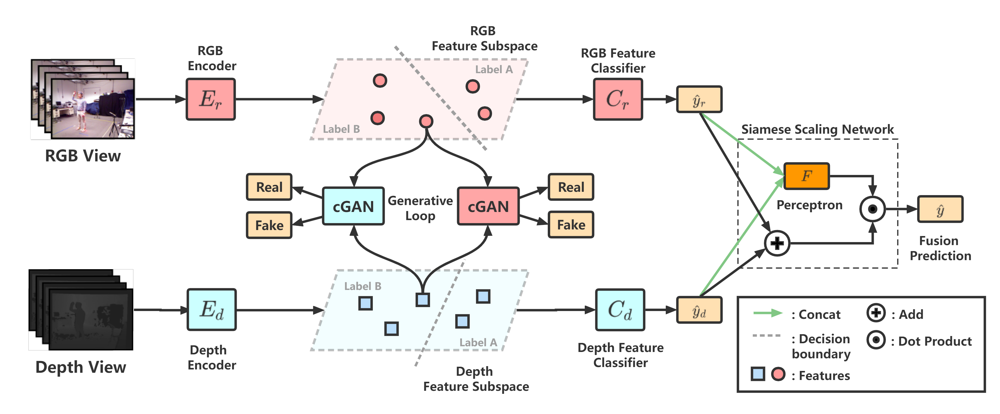
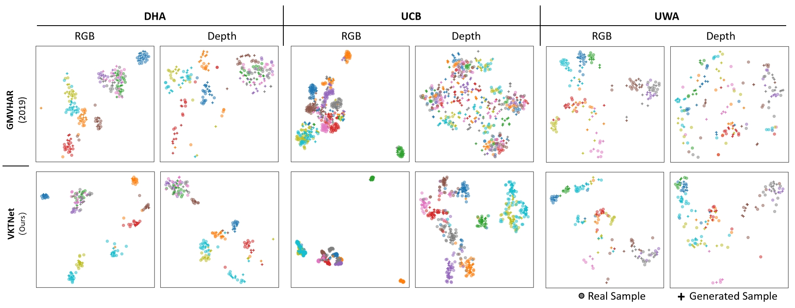

# [IVC 2022] View knowledge transfer network for multi-view action recognition

### [Paper](https://drive.google.com/file/u/0/d/1yylem7CVQaRmY-cevlLPJwoQjt92j28w/view) / [ScienceDirect](https://www.sciencedirect.com/science/article/abs/pii/S0262885621002626)

## Introduction
As many data in practical applications occur or can be captured in multiple views form, multi-view action recognition has received much attention recently, due to utilizing certain complementary and heterogeneous information in various views to promote the downstream task. However, most existing methods assume that multi-view data is complete, which may not always be met in real-world applications.To this end, in this paper, a novel View Knowledge Transfer Network (VKTNet) is proposed to handle multi-view action recognition, even when some views are incomplete.


## Usage
**To run our code, please follow these steps:**

1. [Setup](#setup)
2. [Run VKTNet](#run-vktnet)

## Setup
Our processed dataset is derived from [wanglichenxj/Generative-Multi-View-Human-Action-Recognition](https://github.com/wanglichenxj/Generative-Multi-View-Human-Action-Recognition).

### 1. Git and Create a Conda Environment
```
git clone https://github.com/ZixiLiang/VKTNet.git
conda create -n VKTNet python=3.8
```

### 2. Download [Pytorch](https://pytorch.org/get-started/previous-versions/)(1.13+)
Our VKTNet is tested on CUDA 11.7 with PyTorch 1.13. However, since this code only requires PyTorch as a prerequisite library, any PyTorch version greater than 1.13 should be compatible.

For example,
```
pip install torch==1.13.1+cu117 torchvision==0.14.1+cu117 torchaudio==0.13.1 --extra-index-url https://download.pytorch.org/whl/cu117
```

## Run VKTNet
We combine all components of our model in a single python file. After config the environment, input the command below for the demo:

```python
# For UWA30
python main.py --dataset 0  --batch-size 32 --epochs 10000 --beta=0.7

# For UCB
python main.py --dataset 1  --batch-size 32 --epochs 10000 --beta=0.7

# For DHA
python main.py --dataset 2  --batch-size 32 --epochs 10000 --beta=0.7
```

At the end of each epoch, the value of historical metrics is automatically saved in ```./result.txt``` to facilitate researchers in observing the model's convergence.

## Result
Using t-SNE, the feature subspace learned by our VKTNet for different views in UCB dataset are visualized in Fig. 5. All visualization results have gone through 5000 epochs of training. The results illustrate that the cross-entropy loss based subspace learning module can better keep discriminative information against other.




## Citation
If you find our work useful, please consider citing and star:
```BibTeX
@article{liang2022view,
  title={View knowledge transfer network for multi-view action recognition},
  author={Liang, Zixi and Yin, Ming and Gao, Junli and He, Yicheng and Huang, Weitian},
  journal={Image and Vision Computing},
  volume={118},
  pages={104357},
  year={2022},
  publisher={Elsevier}
}
```

